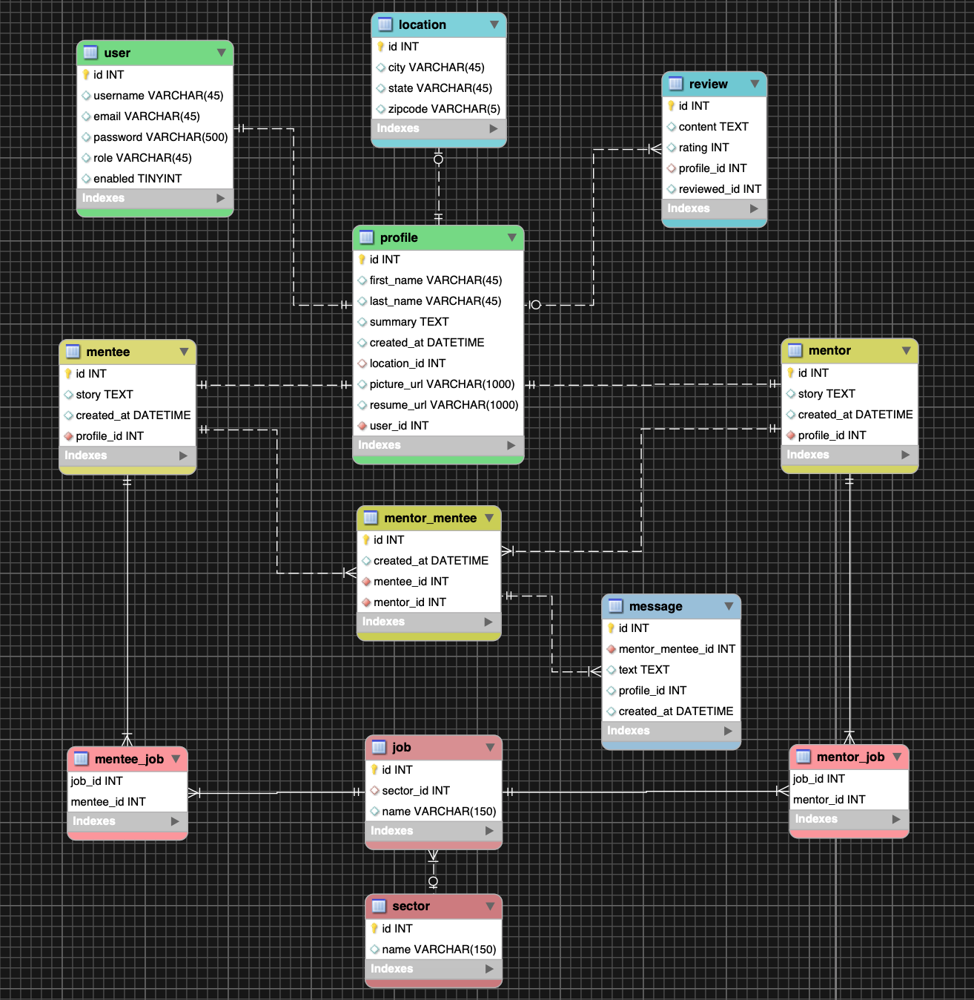
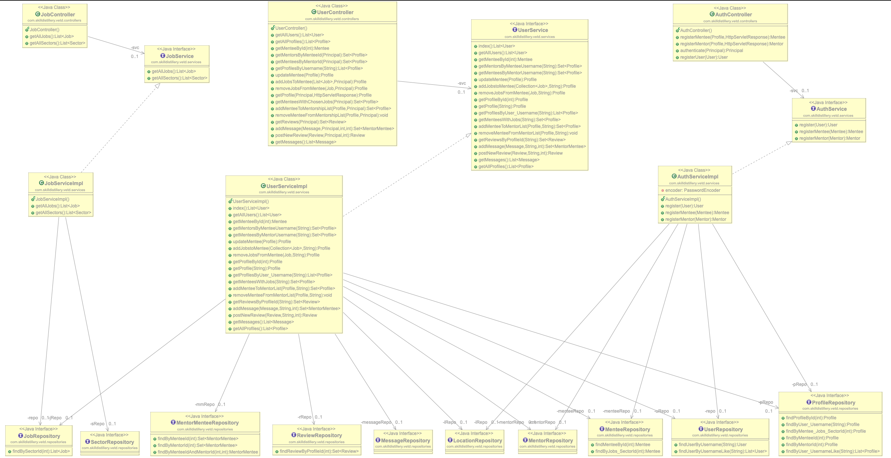

---
# VETd
### Full Stack Final Project for Skill Distillery
---
## Overview
This application implements full C.R.U.D functionality, using Spring Data JPA and RESTful services to connect mentors with mentees.

## Program Purpose
The purpose of this program is to connect already established veterans who are subject matter experts  with transitioning veterans who need mentors. Users will be able to create an account as either a mentee or mertor. A mentee will be able to choose from different job fields in which they would like a mentor and a mentor will be able to select fields in which they are subject matter experts. Upon being matched, users will also be able to review their experience.

## Login
Users will be prompted to register as either a mentor or mentee and create a profile with basic information such as name and location. Upon creation, the user will be directed to their profile page where they can manage their account and add preferred job fields.

## Database Schema

## UML Diagram

## Techniques
- Pair programming
- Git collaboration
- Agile/Scrum

## Technologies Used
- Java
- SQL
- Javascript
- Angular
- Spring Tool Suite
- MySQL Workbench
- VS Code
- Spring Boot
- Gradle
- C.R.U.D
- Bash Terminal
- Github
- Postman
- Trello
- MAMP
- Bootstrap
- Apache Tomcat
- Amazon Web Services
- Slack
- MacDown
- Atom
- Gimp
- Stack Overflow

## Lessons Learned
- Restart your server before you test in postman
- If something is broken, restart everything multiple times and it will magically work
- Don't underestimate the complexity of your application
- Npm install after pulling down updates to the front end

## Stretch Goals
- Live Chat/messaging
- Ability to add new jobs and sectors
- File upload for resume and picture
